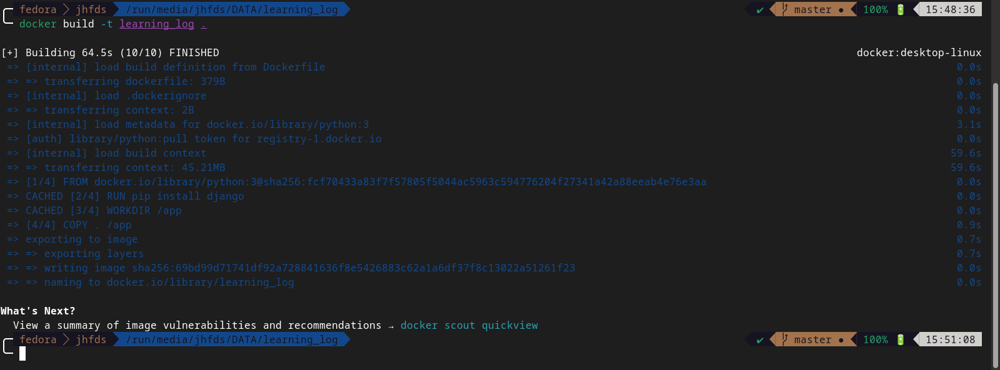
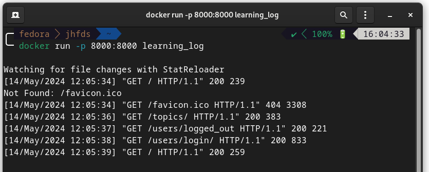
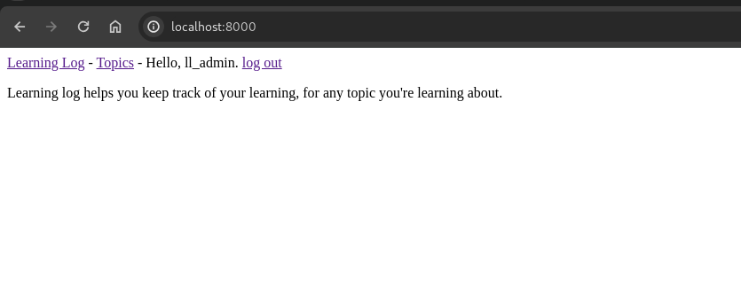
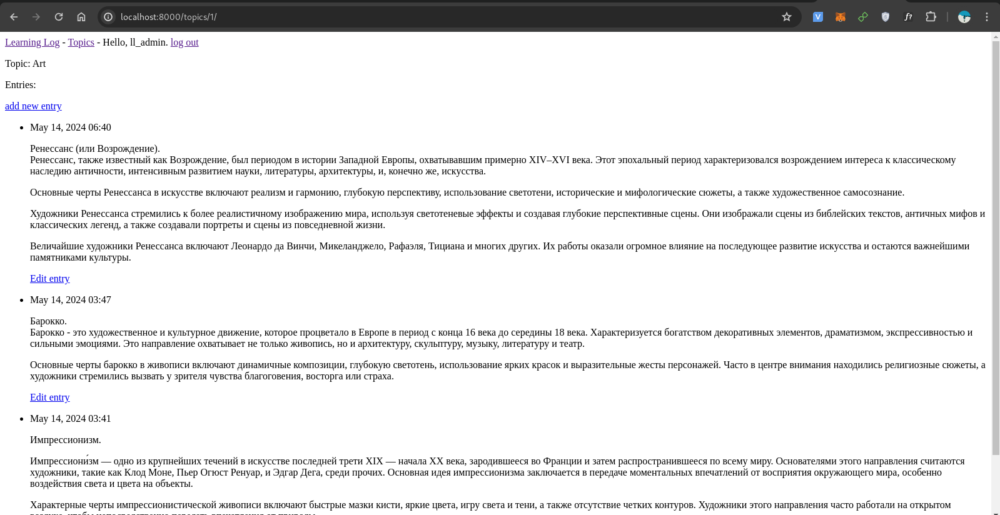
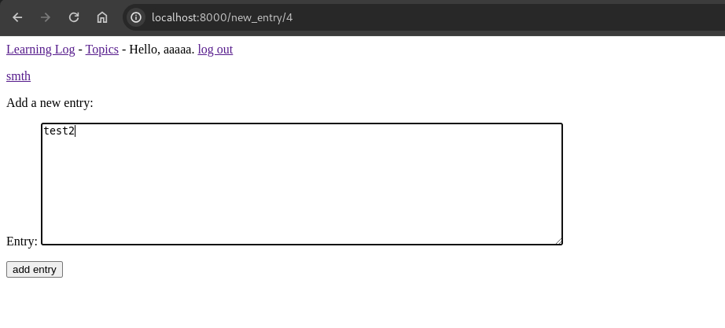
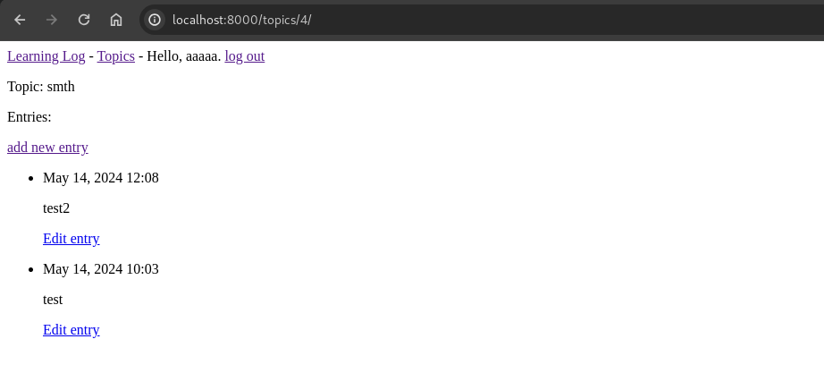
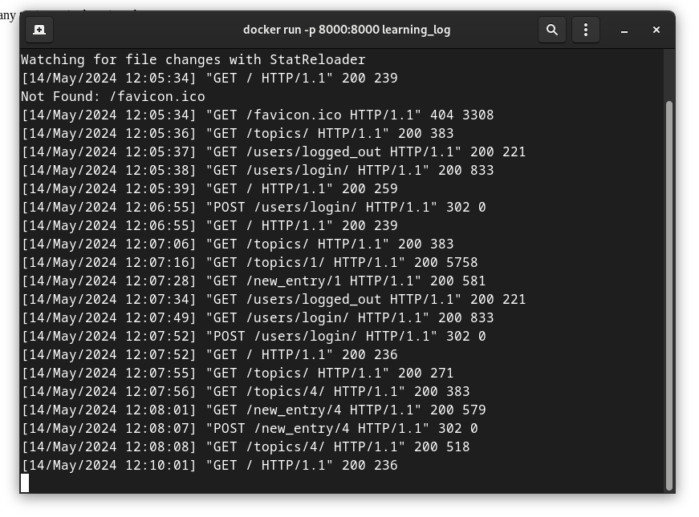
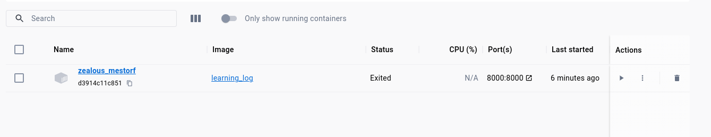
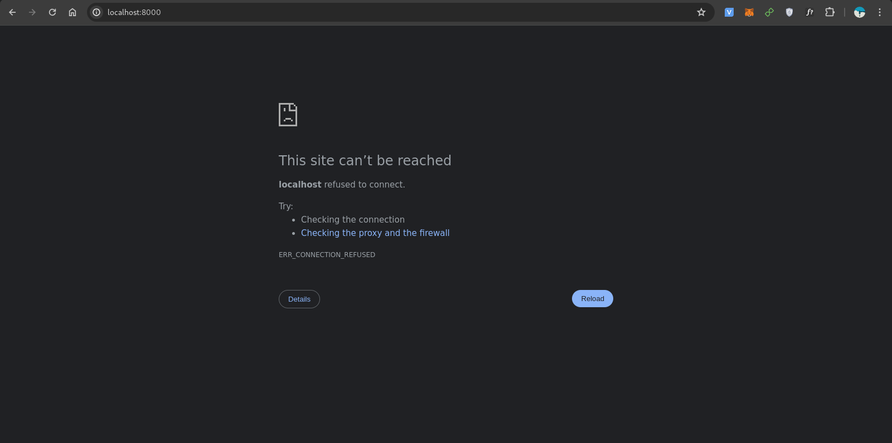

```
University: [ITMO University](https://itmo.ru/ru/)
Faculty: [FICT](https://fict.itmo.ru)
Course: [Application containerization and orchestration](https://github.com/itmo-ict-faculty/application-containerization-and-orchestration)
Year: 2023/2024
Group: K4110c
Author: Sim Maria Lvovna
Practice: practice1
Date of create: 13.05.2023
Date of finished: 13.05.2023
```

### Практическая работа №1 "Контейнеризация микросервисных приложений"

Данная работа предназначена для изучения и практического применения технологии контейнеризации при разработке микросервисных приложений.
#### Ход работы
1. Создать микроcервис на языке программирования Python/Java/любом другом соответствующем следующим требованиям: Поддержка swagger Может быть контейнеризированно Выполняет 1 полезную функцию (степень полезности определяется самостоятельно) Имеет функционал хранение/записи данных в любую БД
2. Определить зависимости приложения и создать Docker образ с помощью Dockerfile.
3. Запустить, приложить доказательства работы приложения.

#### Отчет

Создадим микросервис на языке программирования  Python, выполняющий хотя бы 1 полезную функцию и имеющий функционал хранение/записи данных в любую БД. Работа этого микросервиса будет продемонстрирована в конце отчета.

Соберем Docker образ с помощью Dockerfile.



Запустим контейнер с этим образом.


Проверим работоспособность приложения. В нем можно зарегистрироваться, затем в своем аккаунте создавать топики, в них записи. Записи можно также редактировать.









Если остановить контейнер, в приложение тоже не получится зайти.



