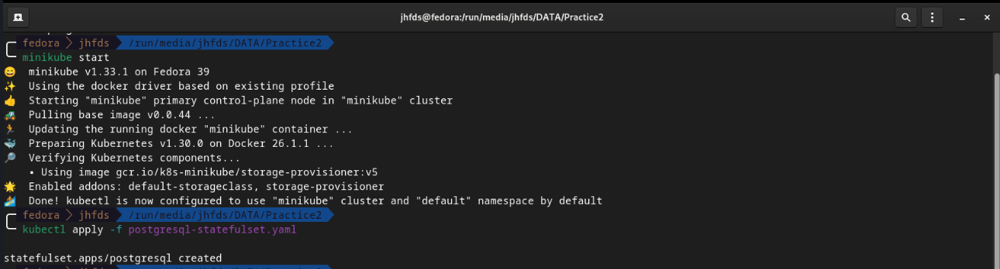

```
University: [ITMO University](https://itmo.ru/ru/)
Faculty: [FICT](https://fict.itmo.ru)
Course: [Application containerization and orchestration](https://github.com/itmo-ict-faculty/application-containerization-and-orchestration)
Year: 2023/2024
Group: K4110c
Author: Sim Maria Lvovna
Practice: practice1
Date of create: 13.05.2023
Date of finished: 14.05.2023
```

### Практическая работа №2 "Базы данных в микросервисных архитектурах"

Данная практическая работа направлена на изучение принципов работы с базами данных в контексте микросервисных приложений.
#### Ход работы
1. Изучить роль баз данных в микросервисной архитектуре.
2. Выбрать и развернуть базу данных в minikube (MongoDB/Postgres/e.t.c)

#### Отчет

Установим minikube и kubectl.
Minikube - это локальный кластер Kubernetes, который позволяет развернуть приложения и службы Kubernetes на вашем локальном компьютере для разработки и тестирования.
kubectl - это инструмент командной строки Kubernetes, который используется для взаимодействия с кластером Kubernetes.

В Kubernetes есть несколько способов развертывания баз данных. Два основных подхода - это использование StatefulSet для приложений, которые требуют уникальных идентификаторов и хранения данных, и использование Deployment для приложений, которые могут быть масштабированы горизонтально и не требуют уникальных идентификаторов.

Создадим namespace `postgresql`:
`kubectl create ns postgresql`

Создадим секрет с аутентификационными данными для базы данных PostgreSQL:
`kubectl -n postgresql create secret generic postgresql --from-literal POSTGRES_USER="admin" --from-literal POSTGRES_PASSWORD="admin" --from-literal POSTGRES_DB="postgres"`


Создадим манифест Kubernetes для развертывания базы данных PostgreSQL как StatefulSet.

```
apiVersion: apps/v1
kind: StatefulSet
metadata:
	name: postgresql
	namespace: postgresql
spec:
	serviceName: "postgresql"
	replicas: 1
	selector:
		matchLabels:
			app: postgresql
	template:
		metadata:
			labels:
				app: postgresql
		spec:
			containers:
			- name: postgresql
			image: "postgres:latest"
			ports:
				- containerPort: 5432
			env:
				- name: POSTGRES_DB
				value: "mydatabase"
				- name: POSTGRES_USER
				value: "myuser"
				- name: POSTGRES_PASSWORD
				value: "mypassword"
			volumeMounts:
				- mountPath: /var/lib/postgresql/data
				name: postgresql-data
	volumeClaimTemplates:
		- metadata:
			name: postgresql-data
		spec:
			accessModes: ["ReadWriteOnce"]
			storageClassName: "standard"
			resources:
				requests:
				storage: 1Gi
```

1. Сохраним предоставленный манифест в файл (например, `postgresql-statefulset.yaml`).
2. Применим манифест с помощью команды `kubectl apply`:
	`kubectl apply -f postgresql-statefulset.yaml`
	


После развертывания базы данных убедимся, что она работает корректно. Для проверки состояния подов, служб и других ресурсов Kubernetes будем использовать kubectl.
3. Проверим статус StatefulSet:
	`kubectl get statefulset postgresql`

4. Проверимстатус подов:
	`kubectl get pods -l app=postgresql`

 5. Проверьте статус PersistentVolumeClaims (PVC):
	`kubectl get pvc -l app=postgresql`

 6. Проверьте статус службы:
	`kubectl get svc postgresql`

StatefulSet был успешно создан и количество текущих реплик равно `1`. Видим запущенный под PostgreSQL и созданный PVC для хранения данных PostgreSQL.
Служба была успешно создана и настроена.


После выполнения этих шагов база данных PostgreSQL успешно развернута и доступна для использования в кластере Kubernetes.
Выполним команду для подключения к одному из подов PostgreSQL. В интерактивной оболочке psql выполним SQL-запрос для создания таблицы. Например: `CREATE TABLE users (id serial, name text);` . Выполним команду `\dt` в psql для просмотра списка всех таблиц в базе данных, получим следующий результат:

Была создана таблица `users` в базе данных `mydatabase`. Мы видим сообщение `CREATE TABLE`, а затем использовали команду `\dt`, чтобы проверить список таблиц, и  таблица `users` присутствует в списке.Таким образом, можно считать, что экземпляр PostgreSQL в Kubernetes работает корректно, и мы можем взаимодействовать с ним через командную строку `psql`. 