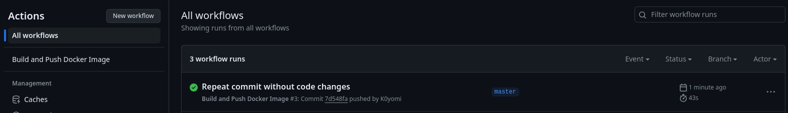
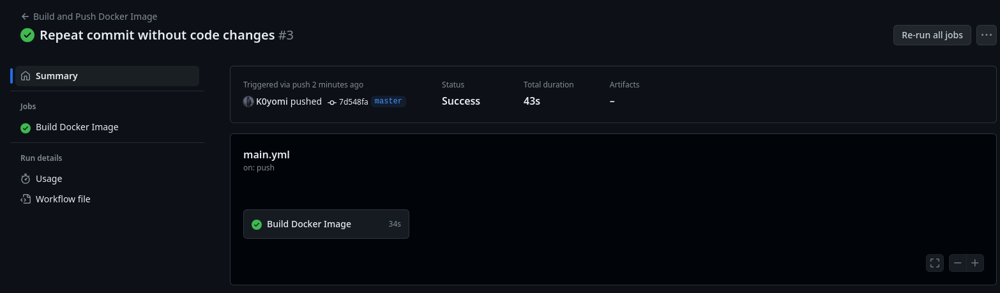

```
University: [ITMO University](https://itmo.ru/ru/)
Faculty: [FICT](https://fict.itmo.ru)
Course: [Application containerization and orchestration](https://github.com/itmo-ict-faculty/application-containerization-and-orchestration)
Year: 2023/2024
Group: K4110c
Author: Sim Maria Lvovna
Practice: practice1
Date of create: 13.05.2023
Date of finished: 14.05.2023
```

### Практическая работа №3 "Развертывание инструментов Ci/Cd для тестового проекта"

Данная практическая работа предполагает установку и настройку специальных инструментов, которые помогут автоматизировать процесс тестирования и развертывания программного обеспечения.
#### Ход работы
1. Изучить основные идеи Continuous Integration (CI) и Continuous Deployment (CD) - методы для ускорения и улучшения качества разработки.
2. Выбрать платформу реализующую Ci/Cd и организовать пайплайн который будет:
3. Проверять ваш код на качество оформления и синтаксические ошибки (Linter)
4. Собирать ваш код в Docker контейнер и пушить в ваш личный Docker Hub
5. Отправлять вам на почту уведомление о завершении pipeline

#### Отчет


GitHub Actions — это платформа непрерывной интеграции и непрерывной поставки (CI/CD), которая позволяет автоматизировать конвейер сборки, тестирования и развертывания.

В качестве CI/CD инструмента использовался GitHub Actions. Создадим конфигурационный файл main.yml в папке `.github/workflows/` репозитория на GitHub.

```
name: Build and Push Docker Image

on:
	push:
		branches:
			- master
jobs:
	build:
		name: Build Docker Image
		runs-on: ubuntu-latest
		
		steps:
			- name: Checkout repository
				uses: actions/checkout@v2
			
		- name: Set up Docker Buildx
			uses: docker/setup-buildx-action@v1
		
		- name: Build Docker image
			run: |
				docker build -t k0yomi/learning_log:latest .
		
		- name: Log in to Docker Hub
			uses: docker/login-action@v1
			with:
				username: ${{ secrets.DOCKER_USERNAME }}
				password: ${{ secrets.DOCKER_PASSWORD }}
		- name: Push Docker image to Docker Hub
			run: |
				docker push k0yomi/learning_log:latest
```

Добавим секреты в репозиторий и протестируем CI/CD.
При успешном исходе получим:



В результате пайплайна была выполнена сборка Docker образа и его публикация на Docker Hub.